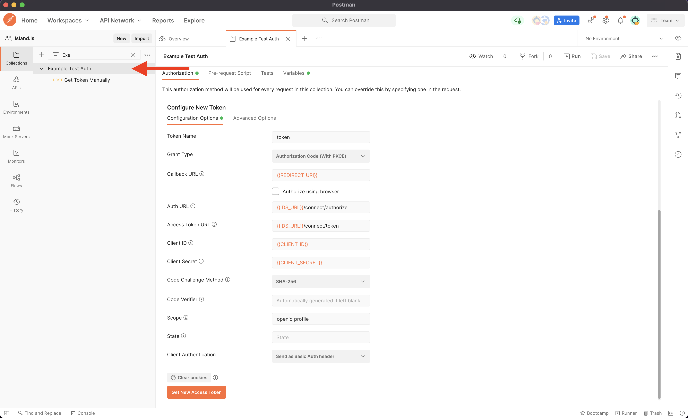
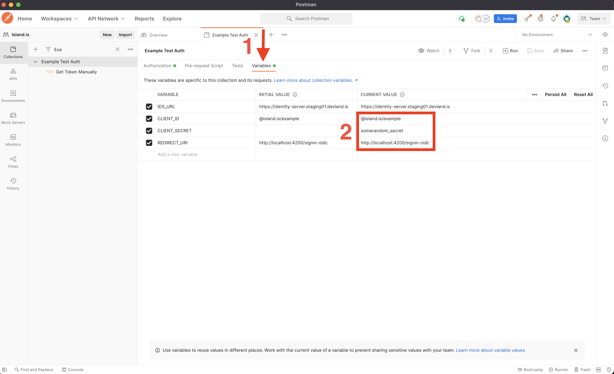
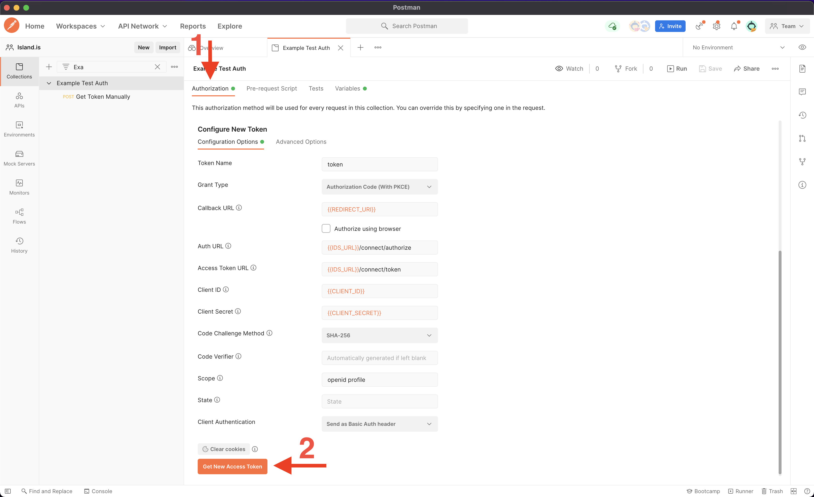
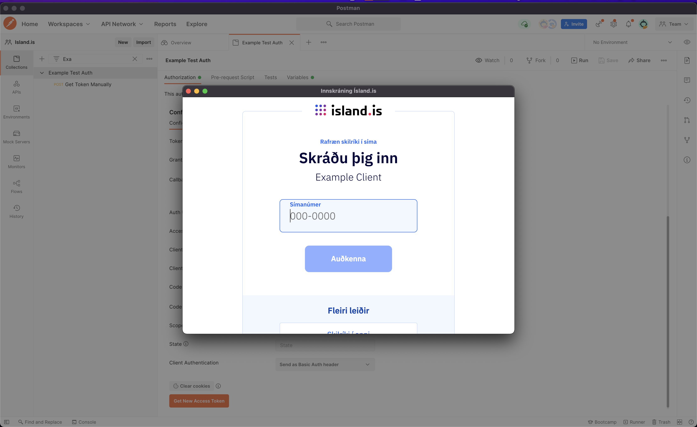
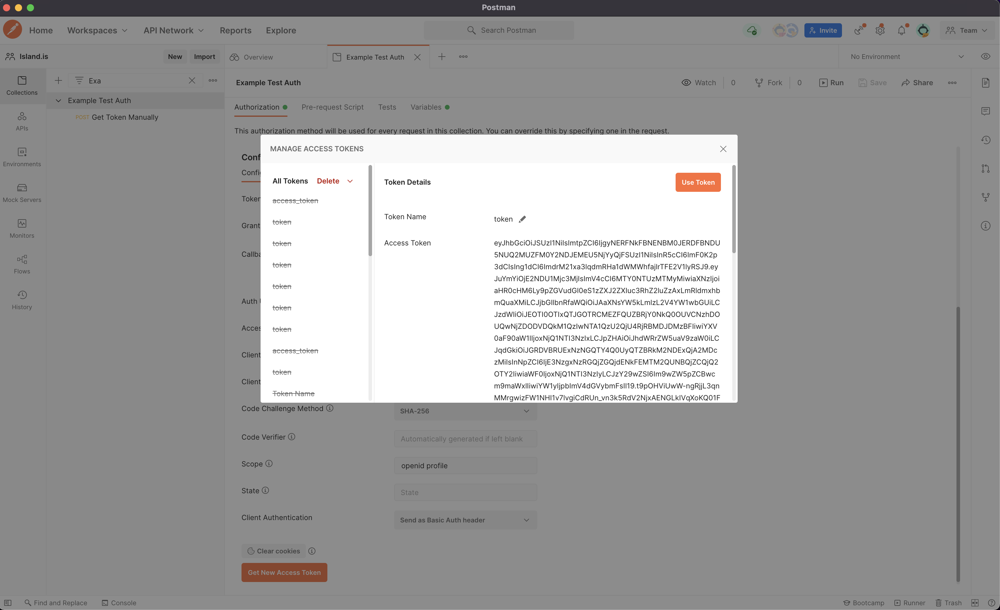
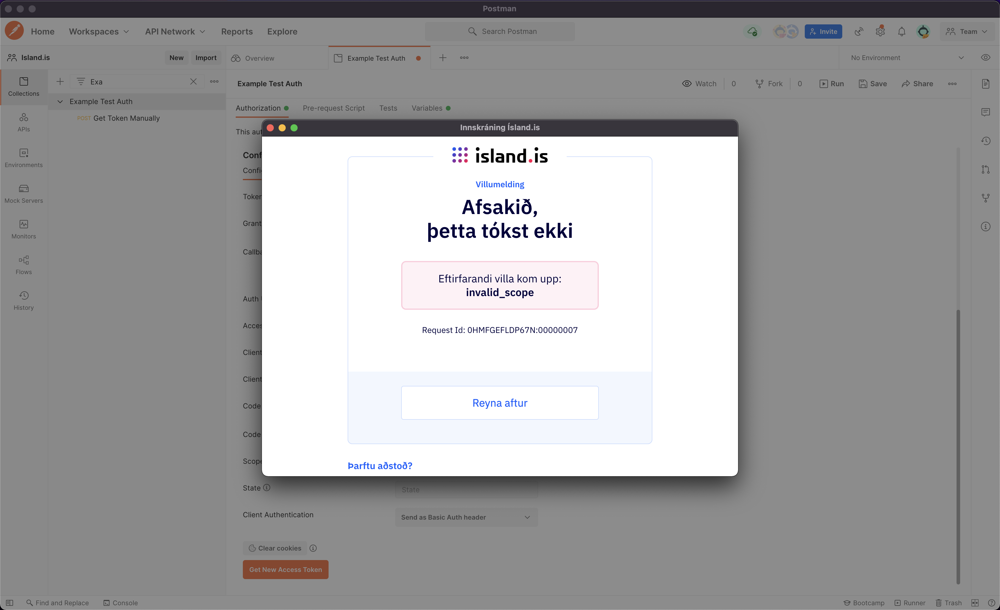
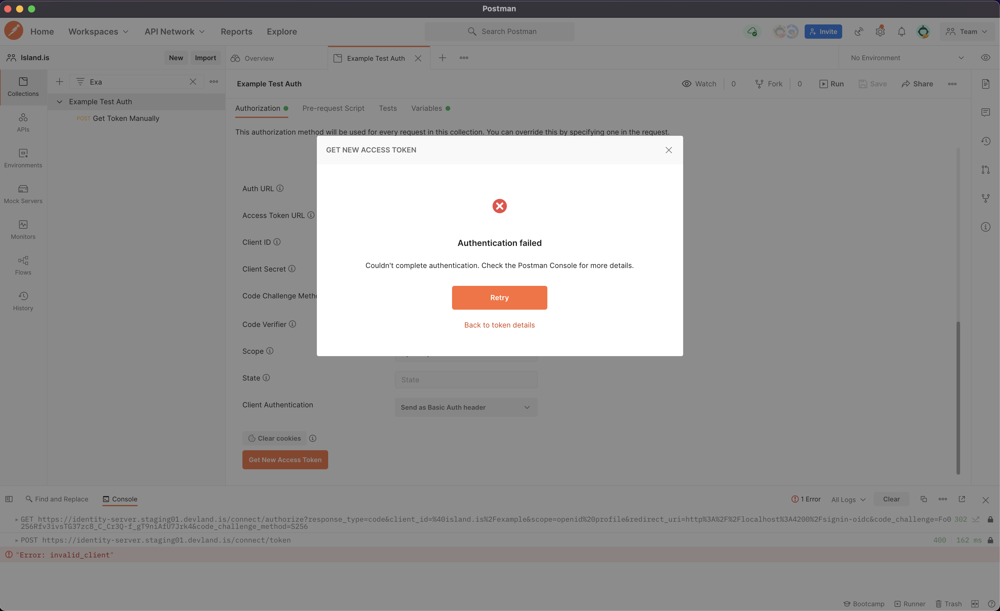

# Test Client With Postman

Here is a guide on how you can verify and test your client configuration using [Postman](https://www.postman.com/).


Before you start, download our example Postman collection


Example Postman Collection




## Step 1 - Navigate to the collection settings

After you have imported the example collection click the collection name in the collection list to open the settings.

## Step 2 - Fill in your variables details

Next you need to fill in your client specific details in the collection variables.
Click the _Variables_ tab and fill in the following details and remember to save:

- `CLIENT_ID`
- `CLIENT_SECRET`
- `REDIRECT_URI`


If you are using Postman Cloud to sync your work or share with your teammates you should protect your `CLIENT_SECRET`. By only setting the **CURRENT VALUE** the value is not synchronized to Postman's cloud.



Remember to save your collection when you have updated the values.


## Step 3 - Get New Access Token

Now you should be able to get new access token in Postman. Click the _Authorization_ tab to open the authorization view. Everything should be configured using the variables.

Here you can update the _Scope_ input if you want to test the client access to some specific scopes, but you should always include the `openid` and `profile` scopes.
For example to test if the client is configured for offline access you could add the `offline` scope so the value would be `openid profile offline`.


We recommend to use [PKCE](https://datatracker.ietf.org/doc/html/rfc7636) even though you are using confidential client with secret. The PKCE improves security to prevent CSRF and authorization code injection attacks.


## Step 4 - Authenticate

After clicking the `Get New Access Token` button Postman opens a dialog. If the client configuration is valid you should see the login screen where you can log in.

If you see some error message check out the [Troubleshooting](#troubleshooting) section for more details.

## Step 5 - Receive tokens

If you authenticate successfully you should see the _Manage Access Tokens_ dialog with your new tokens 🎉

## 🐞 Troubleshooting

Here are the most common errors when testing the client configuration

### invalid_request - Invalid Redirect URI

When you see the message `invalid_request` the most common cause is the _Redirect URI_ provided is not registered as allowed URI in client defintion in IDS.

If you encounter this error pleace contact island.is to verify that the _Redirect URI_ you are using is registered for the client.


The _Redirect URI_ is case sensitive and sensitive for trailing slash.


### invalid_scope - Invalid Client Scope

When you see the message `invalid_scope` one or more scopes in the _Scope_ input does either not exists or the client has not yet been granted access to some scopes.

Varify the scopes in the _Scope_ input and contact island.is if you suspect that your client might be missing access to some scopes.

### unauthorized_client - Invalid Client ID

When you see the message `unauthorized_client` the most common cause is that the _Client ID_ is invalid.

Pleace verify that your configured _Client ID_ is matching the _Client ID_ provided from island.is.

### Authentication failed - Invalid Client Secret

When you see a error message from Postman that the authentication failed and you find the message `Error: invalid_client` in the Postman Console the most common cause is the _Client Secret_ is invalid.

Pleace verify that your configured _Client Secret_ is matching the _Client Secret provided from island.is. If you have lost your \_Client Secret_ pleace contact island.is for a new secret.

